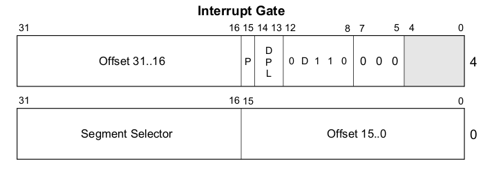
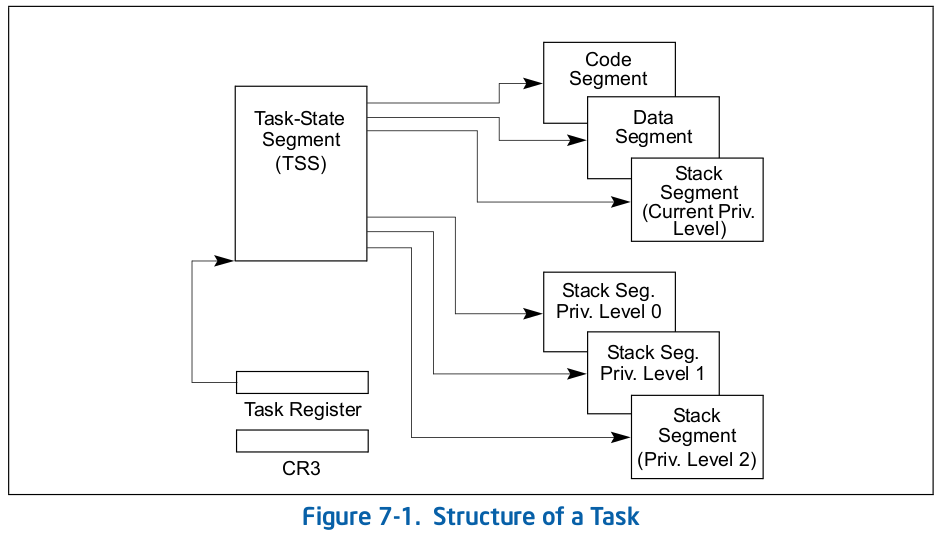
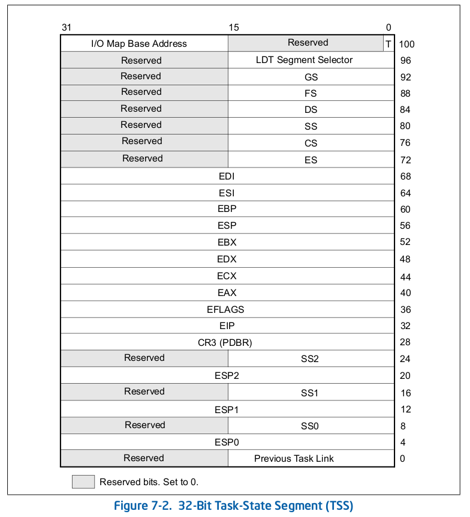
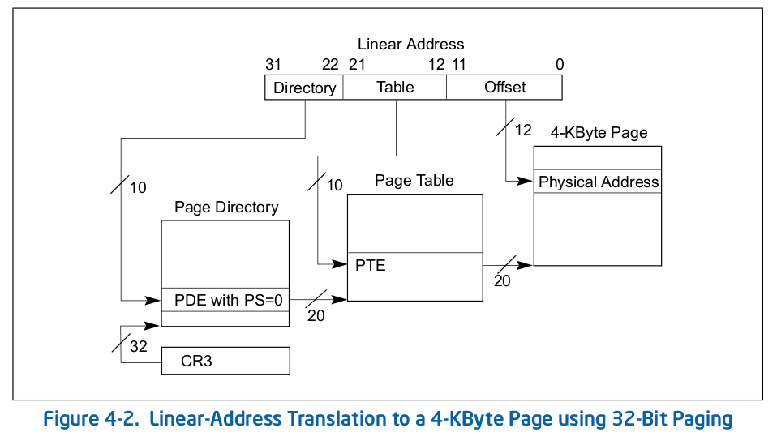

# Walkthrough of _boot_

## Overview

1. Introduction
2. Makefile for _boot_
3. Memory Map: Transferring from _boot0_
4. Linking _boot1_
5. _boot1.s_: Relocating _boot1_
6. _boot1.s_: Reading the MBR from Disk
7. _boot1.s_: Parsing the Partition Table
8. _boot1.s_: Reading _boot_ into Memory 
9. Memory Map: Jumping to _btx_
10. Linking _btx_
11. _btx.s_: Processer Data Structures
12. _btx.s_: Setting Up the IDT
13. _btx.s_: Building the Task-State Segment
14. _btx.s_: Setting Up Paging
15. _btx.s_: Setting Up Protected Mode (PM)
16. Memory Map: Transferring to _boot2.c_ Code
17. LInking _boot2_
18. _boot2_: Important Structures
19. _boot2.c_: Obtain Extended Memory Size
20. _boot2.c _: Accessing the Configuration File
21. _boot2.c_: Skipping Boot2's Prompt
22. _boot2.c_: Loading */boot/loader*

## Introduction

_boot_ is a 16 sector executable that is created from three major components:
_boot1_, _btx_, and _boot2_. _boot1_ is loaded by _boot0_ to 0x7c00,
where it accesses the MBR from hardcoded CHS values, searches the partition
table for the first (in)active FreeBSD slice, and loads the rest of _boot_ to
0x8cec.

_btx_ is a server that operates in kernel mode that sets up a 32-bit C environment
with a provisional GDT and paging structures. It also modifies the IRQs to avoid
confusion with Intel CPU exceptions. Following this, it locates _boot2_ within
_boot_ and relocates it to 0xc000 so that it matches its linked entry point.

_boot2_ is a client that creates a basic command line interface where the user
can specify which loader they would like to use to load the kernel. It is the
first stage of the boot process that has Unix Filesystem (UFS) support. If the
user does not specify a particular loader within an allotted time, /boot/loader
will be loaded into memory and used to complete the bootstrapping process.

## Makefile for _boot_

```make
# $FreeBSD$

PROG=		boot2
NOMAN=
STRIP=
BINDIR?=	/boot
BINMODE=	444
CLEANFILES=	boot boot1 boot1.out boot1.o \
		boot2.ldr boot2.bin boot2.ld boot2.out boot2.o boot2.h \
		boot2.s sio.o

NM?=		nm

# A value of 0x80 enables LBA support.
B1FLAGS=	0x80

BOOT_COMCONSOLE_PORT?= 0x3f8
BOOT_COMCONSOLE_SPEED?= 9600
B2SIOFMT?=	0x3

.if exists(${.OBJDIR}/../btx)
BTX=	${.OBJDIR}/../btx
.else
BTX=	${.CURDIR}/../btx
.endif

REL1=	0x700
ORG1=	0x7c00
ORG2=	0x2000

# Decide Level of UFS support.  UFS1_AND_UFS2 doesn't fit.

# BOOT2_UFS?=	UFS2_ONLY
BOOT2_UFS?=	UFS1_AND_UFS2
# BOOT2_UFS?=	UFS1_ONLY

CFLAGS=	-elf -ffreestanding -Os -fno-builtin \
	-fno-guess-branch-probability -fomit-frame-pointer\
	-mno-align-long-strings \
	-mrtd \
	-D${BOOT2_UFS} \
	-I${.CURDIR}/../../common \
	-I${.CURDIR}/../btx/lib -I. \
	-Wall -Waggregate-return -Wbad-function-cast -Wcast-align \
	-Wmissing-declarations -Wmissing-prototypes -Wnested-externs \
	-Wpointer-arith -Wshadow -Wstrict-prototypes -Wwrite-strings

LDFLAGS=-nostdlib -static -N --gc-sections

all: boot1 boot2 boot

boot: boot1 boot2
	cat boot1 boot2 > boot

boot1: boot1.out
	objcopy -S -O binary boot1.out ${.TARGET}

boot1.out: boot1.o
	${LD} ${LDFLAGS} -e start -Ttext ${ORG1} -o ${.TARGET} boot1.o

boot1.o: boot1.s
	${CPP} ${CFLAGS} ${.IMPSRC} | \
	    ${AS} ${AFLAGS} --defsym FLAGS=${B1FLAGS} -o ${.TARGET}

boot2.o: boot2.c ${.CURDIR}/../../common/ufsread.c
	${CC} ${CFLAGS} -S -o boot2.s.tmp ${.IMPSRC}
	sed -e '/align/d' -e '/nop/d' < boot2.s.tmp > boot2.s
	rm -f boot2.s.tmp
	${AS} ${AFLAGS} -o boot2.o boot2.s

boot2.h: boot1.out
	${NM} -t d ${.ALLSRC} | awk '/([0-9])+ T xread/ \
	 	{ x = $$1 - ORG1; \
		printf("#define XREADORG %#x\n", REL1 + x) }' \
	 	ORG1=`printf "%d" ${ORG1}` \
		REL1=`printf "%d" ${REL1}` > boot2.h

boot2: boot2.ldr boot2.bin ${BTX}/btx/btx
	btxld -v -E ${ORG2} -f bin -b ${BTX}/btx/btx -l boot2.ldr \
		-o boot2.ld -P 1 boot2.bin
	@ls -l boot2.ld | awk '{ x = 7680 - $$5; \
		print x " bytes available"; if (x < 0) exit 1 }'
	dd if=boot2.ld of=${.TARGET} obs=7680 conv=osync 2>/dev/null

boot2.ldr:
	dd if=/dev/zero of=${.TARGET} bs=276 count=1 2>/dev/null

boot2.bin: boot2.out
	objcopy -S -O binary boot2.out ${.TARGET}

boot2.out: boot2.o sio.o
	${LD} ${LDFLAGS} -Ttext ${ORG2} -o ${.TARGET} \
		${BTX}/lib/crt0.o ${.ALLSRC}

boot2.o: boot2.h

sio.o: sio.s
	${AS} ${AFLAGS} --defsym SIOPRT=${BOOT_COMCONSOLE_PORT} \
		--defsym SIOFMT=${B2SIOFMT} \
		--defsym SIOSPD=${BOOT_COMCONSOLE_SPEED} \
		${.IMPSRC} -o ${.TARGET}

install:
	${INSTALL} -o ${BINOWN} -g ${BINGRP} -m ${BINMODE} \
		boot ${DESTDIR}${BINDIR}/boot
	${INSTALL} -o ${BINOWN} -g ${BINGRP} -m ${BINMODE} \
		boot1 ${DESTDIR}${BINDIR}/boot1
	${INSTALL} -o ${BINOWN} -g ${BINGRP} -m ${BINMODE} \
		boot2 ${DESTDIR}${BINDIR}/boot2

.include <bsd.prog.mk>

.if defined(REALLY_AMD64)
boot2.o: machine

beforedepend ${OBJS}: machine

machine:
	ln -sf ${.CURDIR}/../../../i386/include machine

CLEANFILES+=	machine
.endif
```

## Memory Map: Transferring from _boot0_

```txt
____________________________________________________ 0x600
|                                                  |
|                 Relocated Boot0                  |
|__________________________________________________| 0x800
|                                                  |
|               Fake Partition Entry               |
|__________________________________________________| 0x80f
|XXXXXXXXXXXXXXXXXXXXXXXXXXXXXXXXXXXXXXXXXXXXXXXXXX|
|--------------------------------------------------|
|                                                  | 0x7c00
|                    Boot1                         |
|__________________________________________________|
```

## Linking _boot1_

```make
CFLAGS=	-elf -ffreestanding -Os -fno-builtin \
	-fno-guess-branch-probability -fomit-frame-pointer\
	-mno-align-long-strings \
	-mrtd \
	-D${BOOT2_UFS} \
	-I${.CURDIR}/../../common \
	-I${.CURDIR}/../btx/lib -I. \
	-Wall -Waggregate-return -Wbad-function-cast -Wcast-align \
	-Wmissing-declarations -Wmissing-prototypes -Wnested-externs \
	-Wpointer-arith -Wshadow -Wstrict-prototypes -Wwrite-strings

boot1: boot1.out
	objcopy -S -O binary boot1.out ${.TARGET}

boot1.out: boot1.o
	${LD} ${LDFLAGS} -e start -Ttext ${ORG1} -o ${.TARGET} boot1.o

boot1.o: boot1.s
	${CPP} ${CFLAGS} ${.IMPSRC} | \
	    ${AS} ${AFLAGS} --defsym FLAGS=${B1FLAGS} -o ${.TARGET}
```

## _boot1.s_: Relocating _boot1_

```c
//
// Setup the segment registers to flat addressing (segment 0) and setup the
// stack to end just below the start of our code.
// 
main:
		cld				// String ops inc
		xor %cx,%cx			// Zero
		mov %cx,%es			// Address
		mov %cx,%ds			//  data
		mov %cx,%ss			// Set up
		mov $start,%sp		//  stack
//
// Relocate ourself to MEM_REL.  Since %cx == 0, the inc %ch sets
// %cx == 0x100.
// 
		mov %sp,%si			// Source = $start
		mov $MEM_REL,%di	// Destination = 0x700
		incb %ch			// Word count = 256 words (512 bytes)
		rep
		movsw				// Move boot1 to 0x700
```

## _boot1.s_: Reading the MBR from Disk

Since the code in _boot1_ makes no assumption about what loaded it, we must load
the MBR to memory to parse it for the first FreeBSD slice.

```c
//
// If we are on a hard drive, then load the MBR and look for the first
// FreeBSD slice.  We use the fake partition entry below that points to
// the MBR when we call nread.  The first pass looks for the first active
// FreeBSD slice.  The second pass looks for the first non-active FreeBSD
// slice if the first one fails.
// 
		mov $part4,%si		// %si = fake partition; see below
		cmpb $0x80,%dl		// Hard drive?
		jb main.4			// Jump if the drive number is not a hard drive
		movb $0x1,%dh		// Sector Count
		callw nread			// Read MBR into 0x8cec 

        .
        .
        .
// 
// Trampoline used to call read from within boot1. Note that it uses
// hardcoded LBA addressing to access the MBR from the bootable drive.
// 
nread:
		mov $MEM_BUF,%bx		// Transfer buffer
		mov 0x8(%si),%ax		// Get
		mov 0xa(%si),%cx		//  LBA
		push %cs			// Read from
		callw xread.1	 		//  disk
		jnc return			// If success, return
		mov $msg_read,%si		// Otherwise, set the error
						//  message and fall through to
						//  the error routine
        .
        .
        .

part4:	.byte 0x80, 0x00, 0x01, 0x00
		.byte 0xa5, 0xfe, 0xff, 0xff
		.byte 0x00, 0x00, 0x00, 0x00
		.byte 0x50, 0xc3, 0x00, 0x00	// 50000 sectors long, bleh
```

## _boot1.s_: Parsing the Partition Table

```c
		mov $0x1,%cx	 			// Two passes
main.1:
		mov $MEM_BUF+PRT_OFF,%si	// %si = 0x8eaa
		movb $0x1,%dh				// Partition entry
main.2:
		cmpb $PRT_BSD,0x4(%si)		// Is BSD partition?
		jne main.3					// Jump if the partition isn't BSD
		jcxz main.5					// If second pass (cx = 0x0)
		testb $0x80,(%si)			// First Pass: is partition active?
		jnz main.5					// Jump if the partition is active
main.3:
		add $0x10,%si	 			// Next entry
		incb %dh					// Increment partition entry
		cmpb $0x1+PRT_NUM,%dh		// is partition entry < 0x5?
		jb main.2					// Jump if entry < 0x5
		dec %cx						// Decrement cx; start second pass
		jcxz main.1
//
// If we get here, we didn't find any FreeBSD slices at all, so print an
// error message and die.
// 
		mov $msg_part,%si		// Message
		jmp error				// Error
```

## _boot1.s_: Reading _boot_ into Memory

```c
//
// Ok, we have a slice and drive in %dx now, so use that to locate and load
// boot2.  %si references the start of the slice we are looking for, so go
// ahead and load up the first 16 sectors (boot1 + boot2) from that.  When
// we read it in, we conveniently use 0x8cec as our transfer buffer.  Thus,
// boot1 ends up at 0x8cec, and boot2 starts at 0x8cec + 0x200 = 0x8eec.
// The first part of boot2 is the disklabel, which is 0x114 bytes long.
// The second part is BTX, which is thus loaded into 0x9000, which is where
// it also runs from.  The boot2.bin binary starts right after the end of
// BTX, so we have to figure out where the start of it is and then move the
// binary to 0xc000.  Normally, BTX clients start at MEM_USR, or 0xa000, but
// when we use btxld to create boot2, we use an entry point of 0x2000.  That
// entry point is relative to MEM_USR; thus boot2.bin starts at 0xc000.
// 
main.5:
		mov %dx,MEM_ARG			// Move %dx to 0x900
		movb $NSECT,%dh			// Sector count: %dh = 0x10
		callw nread				// Read 16 sectors to 0x8cec
		mov $MEM_BTX,%bx		// %bx = 0x9000, the beginning of BTX
		mov 0xa(%bx),%si		// Set %si to BTX length
		add %bx,%si				// %si = start of boot2.bin 

		mov $MEM_USR+SIZ_PAG*2,%di			// %di = 0xc000; Client page 2
		mov $MEM_BTX+(NSECT-1)*SIZ_SEC,%cx	// %cx = 0xae00

		sub %si,%cx					// Obtain size of client
		rep
		movsb						// Move client to 0xc000
		sub %di,%cx					// Byte count
		xorb %al,%al				// Zero assumed bss from
		rep							// the end of boot2.bin
		stosb						//  up to 0x10000
		callw seta20				// Enable A20
		jmp start+MEM_JMP-MEM_ORG	// Start BTX
// 
// Enable A20 so we can access memory above 1 meg.
// 
seta20:
		cli
seta20.1:
		inb $0x64,%al		// Get status
		testb $0x2,%al		// Busy?
		jnz seta20.1		// Yes
		movb $0xd1,%al		// Command: Write
		outb %al,$0x64		//  output port
seta20.2:
		inb $0x64,%al		// Get status
		testb $0x2,%al		// Busy?
		jnz seta20.2		// Yes
		movb $0xdf,%al		// Enable
		outb %al,$0x60		//  A20
		sti					// Enable interrupts
		retw				// To caller
```

## Memory Map: Jumping to _btx_

```txt
_______________________________________________ 0x600
|                                             |
|           Relocated Boot0/MBR               |
|_____________________________________________| 0x700
|                                             |
|            Relocated Boot1                  |
|_____________________________________________| 0x900
|                                             |
|               Arguments                     |
|_____________________________________________|
|XXXXXXXXXXXXXXXXXXXXXXXXXXXXXXXXXXXXXXXXXXXXX|
|---------------------------------------------| 0x7c00
|                                             |
|                 Boot1                       |
|_____________________________________________|
|XXXXXXXXXXXXXXXXXXXXXXXXXXXXXXXXXXXXXXXXXXXXX|
|---------------------------------------------| 0x8cec
|                                             |
|                 Boot1                       |
|_____________________________________________| 0x8eec
|                                             |
|               Disklabel                     |
|_____________________________________________| 0x9000
|                                             |
|               BTX Server                    |
|_____________________________________________| 
|                                             |
|                 Boot2                       |
|_____________________________________________| 0xacec
|XXXXXXXXXXXXXXXXXXXXXXXXXXXXXXXXXXXXXXXXXXXXX|
|---------------------------------------------| 0xc000
|                                             |
|               BTX Client                    |
|_____________________________________________| 0x10000
```

## Linking _btx_

```make
# $FreeBSD$

M4?=	m4

.if defined(PAGING)
M4FLAGS+=	-DPAGING
.endif

.if defined(BOOT_BTX_NOHANG)
BOOT_BTX_FLAGS=0x1
.else
BOOT_BTX_FLAGS=0x0
.endif

AFLAGS+=	--defsym BTX_FLAGS=${BOOT_BTX_FLAGS}

.if defined(BTX_SERIAL)
BOOT_COMCONSOLE_PORT?= 0x3f8
BOOT_COMCONSOLE_SPEED?= 9600
B2SIOFMT?=	0x3

M4FLAGS+=	-DBTX_SERIAL -DSIOPRT=${BOOT_COMCONSOLE_PORT} \
		-DSIOFMT=${B2SIOFMT} -DSIOSPD=${BOOT_COMCONSOLE_SPEED}
.endif

ORG=	0x9000

all: btx

btx: btx.o
	${LD} -N -e start -Ttext ${ORG} -o btx.out btx.o
	objcopy -S -O binary btx.out ${.TARGET}

btx.o: btx.s
	(cd ${.CURDIR}; ${M4} ${M4FLAGS} btx.s) | \
	   ${AS} ${AFLAGS} -o ${.TARGET}

CLEANFILES+= btx btx.out btx.o

.include <bsd.prog.mk>
```

To create btx server code, the makefile compiles _btx.s_ to _btx.o_ with
typical settings, and links _btx.o_ to have its entry point at _start_ and its
text section at 0x9000. objcopy is then used to create a stripped raw binary
copy named btx.out.

Note that the entry point _start_ points to the BTX header whose first two byte fields are 0xeb (Machine ID) and 0xe (Header size). 0xeb is the opcode for a near jump with a relative offset to the next instruction. Hence, we skip 14 bytes from the next address, which also happens to be equal to the length of the header.

## _btx.s_: Processor Data Structures

### Provisional GDT

|    Name    |    Base    |  Limit  | Flags| Access Byte | Selector |
|:----------:|:----------:|:-------:|:----:|:-----------:|:--------:|
| Null Entry | 0x00000000 | 0x00000 | 0000 | 0x00 | 0x00 |
| SEL\_SCODE | 0x00000000 | 0xfffff | 1100 | 0x9a | 0x40 |
| SEL\_SDATA | 0x00000000 | 0xfffff | 1100 | 0x92 | 0x80 |
| SEL\_RCODE | 0x00000000 | 0x0ffff | 0000 | 0x9a | 0xc0 |
| SEL\_RDATA | 0x00000000 | 0x0ffff | 0000 | 0x92 | 0x100 |
| SEL\_UCODE | 0x0000a000 | 0xfffff | 0000 | 0xfa | 0x140 |
| SEL\_UDATA | 0x0000a000 | 0xfffff | 0000 | 0xf2 | 0x180 |
| SEL\_TSS   | 0x00001f98 | 0x02068 | 0000 | 0x89 | 0x1c0 |


## _btx.s_: Setting Up the IDT

### IDT Entry Fields



From wiki.osdev.org/Interrupt\_Descriptor\_Table#Structure\_IA-32

| Name | Full Name | Description |
|:----:|:---------:|:------------|
| Offset | Offset 16..31 | Higher part of the interrupt's offset |
| P | Present | Set to 0 for unused interrupts |
| DPL | Descriptor Privilege Level | Specifies userspace vs kernel space |
| S | Storage Segment | Set to 0 for interrupt and trap gates |
| Type | Gate Type 0..3 | Interrupt Gates = 0xE |
| Selector | Selector 0..15 | Kernel's selector of the interrupt function |
| Offset | Offset 0..15 | Lower part of the interrupt's offset |

### IDT Control String

```txt
#
# IDT construction control string.
#
idtctl: .byte 0x10,  0x8e		# Int 0x0-0xf
		.word 0x7dfb,intx00		#  (exceptions)
								# Kernel Mode
		
		.byte 0x10,  0x8e		# Int 0x10
		.word 0x1,   intx10		#  (exception)
								# Kernel Mode		

		.byte 0x10,  0x8e		# Int 0x20-0x2f
		.word 0xffff,intx20		#  (hardware)
								# Kernel Mode
		
		.byte 0x1,   0xee		# int 0x30
		.word 0x1,   intx30		#  (system call)
								# User Mode
		
		.byte 0x2,   0xee		# Int 0x31-0x32
		.word 0x1,   intx31		#  (V86, null)
								# User Mode
		.byte 0x0			# End of string
```

### Building the IDT Code

```c
#
# Create IDT.
#
		mov $idtctl,%si			# %si = IDT control string
init.1:
		lodsb				# Loads count from %si to %al
		cbw					# Sign extend %al to %ax
		xchg %ax,%cx			# %cx = %ax; set count variable
		jcxz init.4			# If done
		lodsb				# Loads P, DPL, and type flags to %al
		xchg %ax,%dx	 		# %dx = P:DPL:type flags
		lodsw					# Load control to %ax
		xchg %ax,%bx			# %bx = control
		lodsw				# %ax = handler offset
		mov $SEL_SCODE,%dh	# %dh = supervisor segment selector

init.2:
		shr %bx				# The bit shifted out becomes CF
		jnc init.3			# Jump if we don't handle the interrupt
		mov %ax,(%di)		# Set handler offset (bits 0-15)
		mov %dh,0x2(%di)		# Set selector (bits 16-31)
		mov %dl,0x5(%di)		# Set P:DPL:type flags (bits 40-47)
		add $0x4,%ax			# Next handler

init.3:
		lea 0x8(%di),%di	# Increment to next entry in IDT
		loop init.2			# Loop until %cx = 0
		jmp init.1			# Continue
```

### Exception Jump Table and Handler Code

```c
#
# Exception jump table.
#
intx00:
		push $0x0			# Int 0x0: #DE
		jmp ex_noc			# Divide error
		push $0x1			# Int 0x1: #DB
		jmp ex_noc			# Debug
		push $0x3			# Int 0x3: #BP
		jmp ex_noc			# Breakpoint
		push $0x4			# Int 0x4: #OF
		jmp ex_noc			# Overflow
		push $0x5			# Int 0x5: #BR
		jmp ex_noc			# BOUND range exceeded
		push $0x6			# Int 0x6: #UD
		jmp ex_noc			# Invalid opcode
		push $0x7			# Int 0x7: #NM
		jmp ex_noc			# Device not available
		push $0x8			# Int 0x8: #DF
		jmp except			# Double fault
		push $0xa			# Int 0xa: #TS
		jmp except			# Invalid TSS
		push $0xb			# Int 0xb: #NP
		jmp except			# Segment not present
		push $0xc			# Int 0xc: #SS
		jmp except			# Stack segment fault
		push $0xd			# Int 0xd: #GP
		jmp ex_v86			# General protection
		push $0xe			# Int 0xe: #PF
		jmp except			# Page fault
intx10:
		push $0x10			# Int 0x10: #MF
		jmp ex_noc			# Floating-point error
#
# Handle #GP exception.
#
ex_v86:
		testb $0x2,0x12(%esp,1) 	# V86 mode?
		jz except			# No
		jmp v86mon			# To monitor

#
# Save a zero error code.
#
ex_noc:
		pushl (%esp,1)			# Duplicate int no
		movb $0x0,0x4(%esp,1)		# Fake error code
#
# Handle exception.
#
except:
		cld
		pushl %ds			# Save
		pushl %es			#  most
		pusha				#  registers
		movb $0x6,%al			# Push loop count
		testb $0x2,0x3a(%esp,1) 	# V86 mode?
		jnz except.1			# Yes
		pushl %gs			# Set GS
		pushl %fs			# Set FS
		pushl %ds			# Set DS
		pushl %es			# Set ES
		movb $0x2,%al			# Push loop count
		cmpw $SEL_SCODE,0x44(%esp,1)	# Supervisor mode?
		jne except.1			# No
		pushl %ss			# Set SS
		leal 0x50(%esp,1),%eax		# Set
		pushl %eax			#  ESP
		jmp except.2			# Join common code
except.1:
		pushl 0x50(%esp,1)		# Set GS, FS, DS, ES
		decb %al			#  (if V86 mode), and
		jne except.1			#  SS, ESP
except.2:
		push $SEL_SDATA			# Set up
		popl %ds			#  to
		pushl %ds			#  address
		popl %es			#  data
		movl %esp,%ebx			# Stack frame
		movl $dmpfmt,%esi		# Dump format string
		movl $MEM_BUF,%edi		# Buffer
		pushl %edi			# Dump to
		call dump			#  buffer
		popl %esi			#  and
		call putstr			#  display
		leal 0x18(%esp,1),%esp		# Discard frame
		popa				# Restore
		popl %es			#  registers
		popl %ds			#  saved
		cmpb $0x3,(%esp,1)		# Breakpoint?
		je except.3			# Yes
		cmpb $0x1,(%esp,1)		# Debug?
		jne except.2a			# No
		testl $0x100,0x10(%esp,1)	# Trap flag set?
		jnz except.3			# Yes
except.2a:
		jmp exit			# Exit
except.3:
		leal 0x8(%esp,1),%esp		# Discard err, int no
		iret				# From interrupt
```

## _btx.s_: Building the Task-State Segment



### Task State

According to the Intel manual, the following items define the state of the
currently executing task:

1. The task's **execution space**, defined by the CS, DS, SS, ES, FS, and GS
2. State of the general-purpose registers
3. State of EFLAGS
4. State of EIP
5. State of CR3
6. State of the task register
7. State of the LDTR register
8. I/O map base address and I/O map
9. Stack pointers to privilege 0, 1, and 2 stacks
10. Link to previously executed tasks



### Executing a Task

A task can be executed through:

1. A CALL instruction
2. A JMP instruction
3. An implicit call to an interrupt-handler task
4. An implicit call to an exception-handler task
5. An IRET instruction when the Nested Task (NT) flag in EFLAGS is set

### TSS Initialization Code


```c
#
# Initialize TSS.
#
init.4:
		movb $_ESP0H,0x5(%di)		# ESP0H = 0x1800 >> 8
									# ESP0H = Privilege Level 0 ESP

		movb $SEL_SDATA,0x8(%di)	# SS0 = 0x10
									# SS0 = Privilege Level 0 SS

		movb $_ESP1H,0xd(%di)		# ESP1H = 0x1e00 >> 8
		movb $_TSSIO,0x66(%di)		# I/O Map Base = 0x2000-0x1f98 = 0x68
```

## _btx.s_: Setting Up Paging

### 32-bit Paging

There are two hierarchical data structures in default 32-bit paging: the _Page Directory_ and the _Page Table_. The _page directory_ contains 1024 4-byte entries (total size = 4096 bytes) that store the physical address and access information of a page table. The highest 10 bits (22:31) of a linear address are used to specify an entry in the page directory.

The _page table_ is identical to the page directory except that it contains the address of a _page frame_, which is a 4096 byte range of physical memory. The next 10 bits (12:21) of the linear address are used to specify an entry into the page table. The remaining bits (0:11) specify the offset within that page frame.

### Paging Data Structures



### Paging Initialization Code

```c
#
# Create page directory with eight entries
#
		xor %edx,%edx
		mov $PAG_SIZ>>0x8,%dh	# %dh = 0x1000 >> 0x8 = 0x10
		xor %eax,%eax
		mov $MEM_DIR,%di		# %di = 0x4000
		mov $PAG_CNT>>0xa,%cl	# %cl = 0x4
		mov $MEM_TBL|0x7,%ax	# %ax = 0x5007
								# Page directory entry refers to a present,
								# read/write, usermode page table starting
								# at memory address 0x5000
init.5:
		stosl					# Write entry
		add %dx,%ax				# Increment %ax by 0x1000
		loop init.5				# Loop 4 times
								# Maps 0x5000 - 0x9000 as page tables
#
# Create page tables.
#
		mov $MEM_TBL,%di			# %di = 0x5000
		mov $PAG_CNT>>0x8,%ch		# %ch = 0x1000 >> 0x8 = 0x10
		xor %ax,%ax
init.6:
		mov $0x7,%al					# Set U:W:P flags

		cmp btx_hdr+0x8,%cx	 			# Standard user page?
										# btx_hdr+0x8 is BTX_FLAGS 

		jb init.7						# Jump if %cx > 0xe
		cmp $PAG_CNT-MEM_BTX>>0xc,%cx	# BTX memory?
		jae init.7						# Jump if %cx > 0
		and $~0x2,%al					# Clear W flag
		cmp $PAG_CNT-MEM_USR>>0xc,%cx	# User page zero?
		jne init.7						# No
		testb $0x80,btx_hdr+0x7			# Unmap it?
		jz init.7						# No
		and $~0x1,%al					# Clear P flag
init.7:
		stosl				# Set entry
		add %edx,%eax		# Increment page frame by 0x1000
		loop init.6			# Loop 0x1000 times
							# Create four page tables worth of page frames
```

## _btx.s_: Setting Up Protected Mode (PM)

### Initialize the PICs

#### 8259 PIC Ports

| Chip - Purpose | I/O Port |
|:--------------:|:--------:|
| Master PIC - Command | 0x0020 |
| Master PIC - Data | 0x0021 |
| Slave PIC - COmmand | 0x00a0 |
| Slave PIC - Data | 0x00a1 |

#### Real Mode (BIOS) PIC Settings

| Chip | IRQ | Vector Offset | Interrupt Numbers|
|:----:|:---:|:-------------:|:----------------:|
| Master PIC | 0 - 7 | 0x08 | 0x08 to 0x0F |
| Slave PIC | 8 - 15 | 0x70 | 0x70 to 0x77 |

As you can see above, the BIOS settings for PIC has IRQs 0x0-0x0F overlap with
Intel's CPU exception interrupt vectors 0x0-0x1F. Hence, we must remap IRQs'
0x0-0x0F vector offset to 0x20 so there is no ambiguity between CPU exceptions
and hardware interrupts.

#### PIC Initialization Code

```c
#
# By sending the command 0x11 to the command ports, the PIC expects three
# initialization bytes:
#
#      ICW2 = vector offset
#      ICW3 = how is it wired to master/slave
#      ICW4 = environment information

setpic:
		in $0x21,%al
		push %ax			# Save master's interrupt mask register (IMR)
		in $0xa1,%al
		push %ax			# Save slave's IMR
		movb $0x11,%al		# %al = ICW1 = 0x11
		outb %al,$0x20		# Send ICW1 to master's command
		outb %al,$0xa0		# Send ICW1 to slave's command
		movb %bl,%al		# %al = 0x20
		outb %al,$0x21		# Set vector offset to 0x20
		movb %bh,%al		# %al = 0x28
		outb %al,$0xa1		# Set slave offset to 0x28
		movb $0x4,%al
		outb %al,$0x21		# Set slave at IRQ2
		movb $0x2,%al
		outb %al,$0xa1		# Set slave's cascade identity (IRQ2)
		movb $0x1,%al
		outb %al,$0x21		# Send ICW4 to master
		outb %al,$0xa1		# Send ICW4 to slave
		pop %ax
		outb %al,$0xa1		# Restore slave's IMR
		pop %ax
		outb %al,$0x21		# Restore master's IMR
		retw
		.code32
```

### Activate Paging and Protected Mode

```c
#
# Bring up the system.
#
		mov $0x2820,%bx
		callw setpic			# Set protected mode IRQ offsets
		lidt idtdesc	 		# Set IDT
ifdef(`PAGING',`
		xor %eax,%eax
		mov $MEM_DIR>>0x8,%ah	# %eax = 0x4000
		mov %eax,%cr3			# Set base of the page directory
')
		lgdt gdtdesc	 		# Set GDT
		mov %cr0,%eax			# Load control register 0
ifdef(`PAGING',`
		or $0x80000001,%eax             #  Set PM and paging bits (PAGING DEFINED)
',`
		or $0x01,%eax			# Set PM bit (PAGING not defined)
')
		mov %eax,%cr0			# Update control register 0
		ljmp $SEL_SCODE,$init.8		# Jump to 32-bit code
		.code32
```

### Launch the User Task (BTX Client)

```c
init.8:
		xorl %ecx,%ecx
		movb $SEL_SDATA,%cl			# Supervisor stack selector = 0x10
		movw %cx,%ss				# Update %ss with supervisor stack selector
		movb $SEL_TSS,%cl

		ltr %cx						# Load Task Register (LTR) does the following:
									#   Loads the TSS selector into the task register
									#   Loads the TSS limit and base
									#   Marks the task is marked as busy

		movl $MEM_USR,%edx			# %edx = 0x0000a000
		movzwl %ss:BDA_MEM,%eax 	# Free KiBs starting at addr 0x0
									# We assume this returns 0x280
		shll $0xa,%eax				# Convert free memory count to bytes
									# %eax = 0xa0000
		subl $0x1000,%eax			# %eax = 0x9f000
									# We subtract 0x1000 from the top of avail
									# memory so that we can relocate the bootinfo
									# arguments without overwriting the boot2's
									# user stack
		subl %edx,%eax				# %eax = 0x95000
		movb $SEL_UDATA,%cl			# %cl = 0x30; User data selector
		pushl %ecx					# Set SS
		pushl %eax					# Set ESP
		push $0x202					# Set flags (Interrupt Flag (IF) set)
		push $SEL_UCODE				# Set CS = 0x28
		pushl btx_hdr+0xc			# Set EIP; contains vaddr 0x0
									# Patched at link time!!
									#   No Paging: 0x2000
									#      Paging: 0x30000

		pushl %ecx					# Set GS
		pushl %ecx					# Set FS
		pushl %ecx					# Set DS
		pushl %ecx					# Set ES
		pushl %edx					# Set EAX
		movb $0x7,%cl				# Set remaining
init.9:
		push $0x0			#  general
		loop init.9			#  registers
ifdef(`BTX_SERIAL',`
		call sio_init			# setup the serial console
')
		popa				# Zero out general registers
		popl %es			# Initialize
		popl %ds			#  user
		popl %fs			#  segment
		popl %gs			#  registers
		iret				# This instruction does the following:
							#   Pops the EIP, CS, EFLAGS
							#   Pops ESP and SS for a change in privilege
							#   Saves the execution state of the server in the TR
							#   Resumes execution at the BTX client's code
```

## Memory Map: Transferring to _boot2.c_ Code

```c
___________________________________________________ 0x600
|                                                 |
|                     Boot0                       |
|_________________________________________________| 0x700
|                                                 |
|                Relocated Boot1                  |
|_________________________________________________| 0x900
|                                                 |
|                   Arguments                     |
|_________________________________________________|
|                                                 |
|               Supervisor Stack                  |
|_________________________________________________| 0x1800
|XXXXXXXXXXXXXXXXXXXXXXXXXXXXXXXXXXXXXXXXXXXXXXXXX|
|-------------------------------------------------| 0x1e00
|                                                 |
|           Interrupt Descriptor Table            |
|_________________________________________________| 0x1fa0
|                                                 |
|            Task-State Segment (TSS)             |
|_________________________________________________| 0x2130
|XXXXXXXXXXXXXXXXXXXXXXXXXXXXXXXXXXXXXXXXXXXXXXXXX|
|-------------------------------------------------| 0x4000
|                                                 |
|                 Page Directory                  |
|_________________________________________________| 0x5000
|                                                 |
|                   Page Tables                   |
|_________________________________________________|
|XXXXXXXXXXXXXXXXXXXXXXXXXXXXXXXXXXXXXXXXXXXXXXXXX|
|-------------------------------------------------| 0x8cec
|                                                 |
|                     Boot1                       |
|_________________________________________________| 0x8eec
|                                                 |
|                   Disk Label                    |
|_________________________________________________| 0x9000
|                                                 |
|                   BTX Server                    |
|_________________________________________________|
|XXXXXXXXXXXXXXXXXXXXXXXXXXXXXXXXXXXXXXXXXXXXXXXXX|
|-------------------------------------------------| 0xc000
|                                                 |
|                   BTX Client                    |
|_________________________________________________|
|XXXXXXXXXXXXXXXXXXXXXXXXXXXXXXXXXXXXXXXXXXXXXXXXX|
|-------------------------------------------------|
|                                                 |
|                  User Stack                     |
|_________________________________________________| 0x9f000
```

## Linking _boot2_

```make
boot2: boot2.ldr boot2.bin ${BTX}/btx/btx
	btxld -v -E ${ORG2} -f bin -b ${BTX}/btx/btx -l boot2.ldr \
		-o boot2.ld -P 1 boot2.bin
	@ls -l boot2.ld | awk '{ x = 7680 - $$5; \
		print x " bytes available"; if (x < 0) exit 1 }'
	dd if=boot2.ld of=${.TARGET} obs=7680 conv=osync 2>/dev/null

/* Create an sector of zero bytes for the BSDlabel */
boot2.ldr:
	dd if=/dev/zero of=${.TARGET} bs=276 count=1 2>/dev/null

boot2.bin: boot2.out
	objcopy -S -O binary boot2.out ${.TARGET}

/* Compiles an object file with text starting at 0x2000. It includes the object
** file crt0.o which contains labels __exec and __exit for system calls.
*/
boot2.out: boot2.o sio.o
	${LD} ${LDFLAGS} -Ttext ${ORG2} -o ${.TARGET} \
		${BTX}/lib/crt0.o ${.ALLSRC}

/* gcc compiles the inputs into a single preproccessed file short of assembling
** called boot2.s.tmp. Then it deletes all align statements and nops and writes
** to boot2.s. Then it assembles boot2.s to boot2.o
*/
boot2.o: boot2.c ${.CURDIR}/../../common/ufsread.c
	${CC} ${CFLAGS} -S -o boot2.s.tmp ${.IMPSRC}
	sed -e '/align/d' -e '/nop/d' < boot2.s.tmp > boot2.s
	rm -f boot2.s.tmp
	${AS} ${AFLAGS} -o boot2.o boot2.s

boot2.o: boot2.h

/* nm lists symbols from boot1.out, which is an assembled/linked verison of boot1.s.
** awk searches the list of symbols for a sequence of numbers followed by T xread/, 
**  then it sets x equal to the first field in the record minus ORG1 to obtain
**  address. This address is then printed to boot2.h as "#define XREADORG %#x\n"
**  where the address has a prepended 0x attached to the address. Then it prints
**  ORG1 (0x7c00) and REL1 (0x700) as regular decimal numbers.
*/
boot2.h: boot1.out
	${NM} -t d ${.ALLSRC} | awk '/([0-9])+ T xread/ \
	 	{ x = $$1 - ORG1; \
		printf("#define XREADORG %#x\n", REL1 + x) }' \
	 	ORG1=`printf "%d" ${ORG1}` \
		REL1=`printf "%d" ${REL1}` > boot2.h

/* Assemble sio.s with provided Makefile symbols defined */
sio.o: sio.s
	${AS} ${AFLAGS} --defsym SIOPRT=${BOOT_COMCONSOLE_PORT} \
		--defsym SIOFMT=${B2SIOFMT} \
		--defsym SIOSPD=${BOOT_COMCONSOLE_SPEED} \
		${.IMPSRC} -o ${.TARGET}
```

Creating _boot2_ is a much more involved process than _boot1_. First, we create
_sio.o_ by assembling _sio.s_ with several Makefile symbols defined. Then we
assemble _boot2.h_, which requires us to read the symbol table of boot1.out to
obtain the address of _xread_ and subtract it by ORG1 (0x7c00) to obtain its
offset. Once we have the offset of _xread_, we print a preprocessor command to
define XREADORG as the offset and define ORG1 and REL1 as global variables with
decimal values.

After creating _boot2.h_, we compile _boot2.o_ from _boot2.c_ and _ufsread.c_
by creating a temporary assembly file called _boot2.s.tmp_ which we strip of
all alignment statements and no-ops before assembling it. Next, we create
_boot2.out_ by linking _boot2.o_ with _crt0.o_, which contains the labels for
two system calls *\_\_exec* and *\_\_exit*. Details for _crt0.o_ are provided
in the next code block. Finally, we create a stripped version of _boot2.out_
with objcopy and link it with a zero padded sector _boot2.ldr_ and _btx_
using btxld to create _boot2_.

```make
# $FreeBSD$

OBJS=		btxcsu.o btxsys.o btxv86.o
CLEANFILES=	crt0.o

all: crt0.o

crt0.o: ${OBJS}
	${LD} ${LDFLAGS} -i -o ${.TARGET} ${OBJS}

.include <bsd.prog.mk>
```

## _boot2_: Important Structures

### *bootinfo* Structure

```c
/*
 * A zero bootinfo field often means that there is no info available.
 * Flags are used to indicate the validity of fields where zero is a
 * normal value.
 */
struct bootinfo {
	u_int32_t	bi_version;
	u_int32_t	bi_kernelname;		/* represents a char * */
	u_int32_t	bi_nfs_diskless;	/* struct nfs_diskless * */
				/* End of fields that are always present. */
#define	bi_endcommon	bi_n_bios_used
	u_int32_t	bi_n_bios_used;
	u_int32_t	bi_bios_geom[N_BIOS_GEOM];
	u_int32_t	bi_size;
	u_int8_t	bi_memsizes_valid;
	u_int8_t	bi_bios_dev;		/* bootdev BIOS unit number */
	u_int8_t	bi_pad[2];
	u_int32_t	bi_basemem;
	u_int32_t	bi_extmem;
	u_int32_t	bi_symtab;		/* struct symtab * */
	u_int32_t	bi_esymtab;		/* struct symtab * */
				/* Items below only from advanced bootloader */
	u_int32_t	bi_kernend;		/* end of kernel space */
	u_int32_t	bi_envp;		/* environment */
	u_int32_t	bi_modulep;		/* preloaded modules */
};
```

### *dirent* Structure

```c
struct dirent {
	__uint32_t d_fileno;		/* file number of entry */
	__uint16_t d_reclen;		/* length of this record */
	__uint8_t  d_type; 		/* file type, see below */
	__uint8_t  d_namlen;		/* length of string in d_name */
#if __BSD_VISIBLE
#define	MAXNAMLEN	255
	char	d_name[MAXNAMLEN + 1];	/* name must be no longer than this */
#else
	char	d_name[255 + 1];	/* name must be no longer than this */
#endif
};

```

### *dmadat* Structure

```c
/*
** Located in /boot/common/ufsread.c
*/
struct dmadat {
		char blkbuf[VBLKSIZE];	/* filesystem blocks */
		char indbuf[VBLKSIZE];	/* indir blocks */
		char sbbuf[SBLOCKSIZE];	/* superblock */
		char secbuf[DEV_BSIZE];	/* for MBR/disklabel */
};
static struct dmadat *dmadat;
```

### *dsk* Structure

```c
/*
** Located in /boot/i386/boot2/boot2.c
*/

static struct dsk {
	unsigned drive;
	unsigned type;
	unsigned unit;
	unsigned slice;
	unsigned part;
	unsigned start;
	int init;
} dsk;
```

## _boot2.c_: Obtain Extended Memory Size

### *v86* Structure

```c
/*
** Located in /boot/i386/btx/lib/btxv86h
*/

struct __v86 {
	uint32_t ctl;	/* Control flags */
	uint32_t addr;	/* Interrupt number or address */
	uint32_t es;	/* V86 ES register */
	uint32_t ds;	/* V86 DS register */
	uint32_t fs;	/* V86 FS register */
	uint32_t gs;	/* V86 GS register */
	uint32_t eax;	/* V86 EAX register */
	uint32_t ecx;	/* V86 ECX register */
	uint32_t edx;	/* V86 EDX register */
	uint32_t ebx;	/* V86 EBX register */
	uint32_t efl;	/* V86 eflags register */
	uint32_t ebp;	/* V86 EBP register */
	uint32_t esi;	/* V86 ESI register */
	uint32_t edi;	/* V86 EDI register */
};
```
### Code

```c
static inline uint32_t
memsize(void)
{
    v86.addr = MEM_EXT;		// v86.addr = 0x15
    v86.eax = 0x8800;
    v86int();				// BIOS Call:
							// INT 0x15, AH = 0x88
							// Returns ext memory size 1MB-16MB
    return v86.eax;
}

main(void)
{
	.
	.
	.
	bootinfo.bi_size = sizeof(bootinfo);
	bootinfo.bi_basemem = 0;			// Will be filled by loader or kernel
	bootinfo.bi_extmem = memsize();		// use V86 Mode to execute BIOS INT 0x88
	bootinfo.bi_memsizes_valid++;
}
```

## _boot2.c_: Accessing the Configuration File

For this code block we assume that there is no configuration file. However, 
if there is one, it won't change the flow of execution so long as its commands
are valid. For reference on the UFS api please consult ufs\_api.md.

```c
    /* Process configuration file */

    autoboot = 1;

    if ((ino = lookup(PATH_CONFIG)))	// ino = lookup(/boot.config)
		fsread(ino, cmd, sizeof(cmd));		// Reads a string of 4 bytes
	
    if (*cmd)
	{
		printf("%s: %s", PATH_CONFIG, cmd);
		if (parse())
	    	autoboot = 0;
		/* Do not process this command twice */
		*cmd = 0;
    }
}
```

## _boot2.c_: Skipping Boot2's Prompt

Since we are assuming a simple boot process with no configuration file, _boot2_
will check to see if the static _kname_ buffer is set, and upon confirmation
that it is indeed empty will copy the path to the default loader into it. Then,
the processor will wait three seconds for any keypresses before executing the
stage 3 boot loader.

```c
    /*
     * Try to exec stage 3 boot loader. If interrupted by a keypress,
     * or in case of failure, try to load a kernel directly instead.
     */

    if (autoboot && !*kname) {
		memcpy(kname, PATH_BOOT3, sizeof(PATH_BOOT3));	/* kname = "boot/loader" */

	/*
    ** If the user doesn't press a key within three seconds, load the stage 3
	** boot loader.
	*/
	if (!keyhit(3*SECOND)) {
	    load();
	    memcpy(kname, PATH_KERNEL, sizeof(PATH_KERNEL));
	}
    }
```

## _boot2.c_: Loading */boot/loader* Into Memory

### ELF Structures

```c
/*
 * ELF header.
 */
typedef struct {
	unsigned char	e_ident[EI_NIDENT];	/* File identification. */
	Elf32_Half	e_type;		/* File type. */
	Elf32_Half	e_machine;	/* Machine architecture. */
	Elf32_Word	e_version;	/* ELF format version. */
	Elf32_Addr	e_entry;	/* Entry point. */
	Elf32_Off	e_phoff;	/* Program header file offset. */
	Elf32_Off	e_shoff;	/* Section header file offset. */
	Elf32_Word	e_flags;	/* Architecture-specific flags. */
	Elf32_Half	e_ehsize;	/* Size of ELF header in bytes. */
	Elf32_Half	e_phentsize;	/* Size of program header entry. */
	Elf32_Half	e_phnum;	/* Number of program header entries. */
	Elf32_Half	e_shentsize;	/* Size of section header entry. */
	Elf32_Half	e_shnum;	/* Number of section header entries. */
	Elf32_Half	e_shstrndx;	/* Section name strings section. */
} Elf32_Ehdr;

/*
 * Section header.
 */
typedef struct {
	Elf32_Word	sh_name;	/* Section name (index into the
					   section header string table). */
	Elf32_Word	sh_type;	/* Section type. */
	Elf32_Word	sh_flags;	/* Section flags. */
	Elf32_Addr	sh_addr;	/* Address in memory image. */
	Elf32_Off	sh_offset;	/* Offset in file. */
	Elf32_Size	sh_size;	/* Size in bytes. */
	Elf32_Word	sh_link;	/* Index of a related section. */
	Elf32_Word	sh_info;	/* Depends on section type. */
	Elf32_Size	sh_addralign;	/* Alignment in bytes. */
	Elf32_Size	sh_entsize;	/* Size of each entry in section. */
} Elf32_Shdr;

/*
 * Program header.
 */
typedef struct {
	Elf32_Word	p_type;		/* Entry type. */
	Elf32_Off	p_offset;	/* File offset of contents. */
	Elf32_Addr	p_vaddr;	/* Virtual address in memory image. */
	Elf32_Addr	p_paddr;	/* Physical address (not used). */
	Elf32_Size	p_filesz;	/* Size of contents in file. */
	Elf32_Size	p_memsz;	/* Size of contents in memory. */
	Elf32_Word	p_flags;	/* Access permission flags. */
	Elf32_Size	p_align;	/* Alignment in memory and file. */
} Elf32_Phdr;
```

### *exec* Structure

```c
/*
 * Header prepended to each a.out file.
 * only manipulate the a_midmag field via the
 * N_SETMAGIC/N_GET{MAGIC,MID,FLAG} macros in a.out.h
 */
struct exec {
     unsigned long	a_midmag;	/* flags<<26 | mid<<16 | magic */
     unsigned long	a_text;		/* text segment size */
     unsigned long	a_data;		/* initialized data size */
     unsigned long	a_bss;		/* uninitialized data size */
     unsigned long	a_syms;		/* symbol table size */
     unsigned long	a_entry;	/* entry point */
     unsigned long	a_trsize;	/* text relocation size */
     unsigned long	a_drsize;	/* data relocation size */
};
```

### Loading Code

```c
static void
load(void)
{
    union {
	struct exec ex;
	Elf32_Ehdr eh;
    } hdr;					// Union for parsing kernel binary's header
    Elf32_Phdr ep[2];
    Elf32_Shdr es[2];
    caddr_t p;
    ino_t ino;
    uint32_t addr, x;
    int fmt, i, j;

    if (!(ino = lookup(kname))) {	// Invalid path or not reg file
	if (!ls)
	    printf("No %s\n", kname);
	return;
    }

    if (xfsread(ino, &hdr, sizeof(hdr)))	// Invalid header format
		return;
    if (N_GETMAGIC(hdr.ex) == ZMAGIC)	// ZMAGIC = 0413, demand load format
		fmt = 0;
    else if (IS_ELF(hdr.eh))	// { 0x7f, 'E', 'L', 'F' }
		fmt = 1;
    else
	{
		printf("Invalid %s\n", "format");
		return;
    }

	/*
	** Demand Load Format
	*/
    if (fmt == 0)
	{
		addr = hdr.ex.a_entry & 0xffffff;
		p = PTOV(addr);							// p = vaddr of kernel entry point
		fs_off = PAGE_SIZE;						// fs_off = 0x1000
		if (xfsread(ino, p, hdr.ex.a_text))		// Write .text in memory
	    	return;

		p += roundup2(hdr.ex.a_text, PAGE_SIZE);	// Increment p by sizeof(.text)

		if (xfsread(ino, p, hdr.ex.a_data))			// Write .data in memory
	    	return;

		p += hdr.ex.a_data + roundup2(hdr.ex.a_bss, PAGE_SIZE);	// Increment p by sizeof(.data)

		bootinfo.bi_symtab = VTOP(p);							// Record location of symbol table
		memcpy(p, &hdr.ex.a_syms, sizeof(hdr.ex.a_syms));		// Write size of the symbol table in memory
		p += sizeof(hdr.ex.a_syms);								// Increment p by 4 bytes (a_syms is a long)

		if (hdr.ex.a_syms)	// If the symbol table has size > 0
		{
	    	if (xfsread(ino, p, hdr.ex.a_syms))		// Write the symbol table to memory
				return;
	    	p += hdr.ex.a_syms;						// Increment p by the size of the memory table
	    	if (xfsread(ino, p, sizeof(int)))
				return;
	    	x = *(uint32_t *)p;
	    	p += sizeof(int);
	    	x -= sizeof(int);
	    	if (xfsread(ino, p, x))
				return;
	    	p += x;
		}
    }
	else	// ELF Header 
	{
		fs_off = hdr.eh.e_phoff;	// Store program header table file offset

		/*
		** Store the first two loadable program header table entries
		** into ep array.
		*/
		for (j = i = 0; i < hdr.eh.e_phnum && j < 2; i++)
		{
	    	if (xfsread(ino, ep + j, sizeof(ep[0])))
				return;
	 	   if (ep[j].p_type == PT_LOAD)		// program header loadable?
			j++;
		}

		for (i = 0; i < 2; i++)		// Write two program headers into memory
		{
	    	p = PTOV(ep[i].p_paddr & 0xffffff);		// p = vaddr of the prog header
	    	fs_off = ep[i].p_offset;				// Set file offset equal to
													// the program header offset
	    	if (xfsread(ino, p, ep[i].p_filesz))
				return;
		}
		p += roundup2(ep[1].p_memsz, PAGE_SIZE);	// Increment p by size of last header

		bootinfo.bi_symtab = VTOP(p);	// Store symbol table vaddr
		if (hdr.eh.e_shnum == hdr.eh.e_shstrndx + 3)	// Something obscure
		{
			/*
			** Set file offset equal to the section header that contains the
			** section names
			*/
	    	fs_off = hdr.eh.e_shoff + sizeof(es[0]) * (hdr.eh.e_shstrndx + 1);

			// Read two section header table entries into es
	    	if (xfsread(ino, &es, sizeof(es)))
				return;
	    	for (i = 0; i < 2; i++)	// Read two section headers into memory
			{
				// Copy section header's size to memory
				memcpy(p, &es[i].sh_size, sizeof(es[i].sh_size));
				p += sizeof(es[i].sh_size);
				fs_off = es[i].sh_offset;
				if (xfsread(ino, p, es[i].sh_size)) 
		    		return;
				p += es[i].sh_size;
	    	}
		}
		addr = hdr.eh.e_entry & 0xffffff;	// Set address to loader entry point
    }
    bootinfo.bi_esymtab = VTOP(p);
    bootinfo.bi_kernelname = VTOP(kname);
    bootinfo.bi_bios_dev = dsk.drive;

	// Jump to /boot/loader's entry point
    __exec((caddr_t)addr, RB_BOOTINFO | (opts & RBX_MASK),
	   MAKEBOOTDEV(dev_maj[dsk.type], 0, dsk.slice, dsk.unit, dsk.part),
	   0, 0, 0, VTOP(&bootinfo));
}
```
## Transferring to *loader* via System Call

We use a system call to transfer control to a kernel mode program so that we
do NOT modify the contents of the TSS. If we were to use a normal call, its
contents would be replaced by the state of the BTX client _boot2_ and lose all
information on the BTX server's state.

As a consequence of using a system call with a change in privilege, we need to
visualize and monitor all changes to the supervisor/user stack from now on until
we understand how the kernel accesses _bootinfo_ in its initialization code.

### Stacks When We Call *\_\_exec*
```txt
          User Stack
_____________________________________ 0x9f000
|                                   |
| int autoboot                      |
|___________________________________|
|                                   |
| ino_t ino                         |
|___________________________________|
|                                   |
| return address to main()          |
|___________________________________|
|                                   |
| union hdr                         |
|___________________________________|
|                                   |
| Elf32_Phdr ep                     |
|___________________________________|
|                                   |
| Elf32_Shdr es                     |
|___________________________________|
|                                   |
| caddr_t p                         |
|___________________________________|
|                                   |
| uint32_t addr, x                  |
|___________________________________|
|                                   |
| int fmt, i, j                     |            Supervisor Stack
|___________________________________|  __________________________________________ 0x1800
|                                   |  |                                        |
| uint32 VTOP(&bootinfo)            |  | SS (SEL_UDATA)                         |
|___________________________________|  |________________________________________|
|                                   |  |                                        |
| uint32 0, 0, 0                    |  | User ESP Offset                        |
|___________________________________|  |________________________________________|
|                                   |  |                                        |
| uint32 MAKEBOOTDEV                |  | EFLAGS                                 |
|___________________________________|  |________________________________________|
|                                   |  |                                        |
| RB_BOOTINFO | (opts & RBX_MASK)   |  | CS (SEL_UCODE)                         |
|___________________________________|  |________________________________________|
|                                   |  |                                        |
| caddr_t addr (loader entry)       |  | EIP                                    |
|___________________________________|  |________________________________________|
|                                   |  |                                        |
| return address to load()          |  | Error Code                             |
|___________________________________|  |________________________________________|
```

### *\_\_exec* Code

```c
#
# Constants.
#
		.set INT_SYS,0x30		# Interrupt number
#
# System call: exec
#
__exec:
		movl $0x1,%eax			# BTX system
		int $INT_SYS			#  call 0x1

#
# System Call.
#
intx30:
		cmpl $SYS_EXEC,%eax		# Exec system call?
		jne intx30.1			# Jump if %eax =/= 0x1
#
# Set all segment registers equal to SEL_SDATA
#
		pushl %ss
		popl %es
		pushl %es
		popl %ds
		pushl %ds
		popl %fs
		pushl %fs
		popl %gs
#
# Next section can be tricky. Recall that the base of SEL_SDATA is 0x0, whereas
# the base of SEL_UDATA is 0xa000. This means that when we load the value of
# the user's esp offset from the supervisor stack, we will need add 0xa000 to
# it to obtain the address user esp points to using SEL_SDATA in %ss.
#
		movl $MEM_USR,%eax		# %eax = 0xa000
		addl 0xc(%esp,1),%eax	# %eax = (user esp offset) + 0xa000 = user esp
		leal 0x4(%eax),%esp		# Set %esp to point to /boot/loader entry point
		popl %eax				# Call
		call *%eax				#  /boot/loader
```
