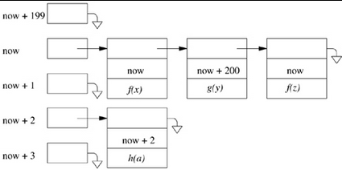

# D & I of FreeBSD Chapter 3 Notes

Before *init* is created, the kernel creates *kernel processes* that always exist/execute in kernel mode. For example, there is a *kernel process* that handles interrupts for each device on the system.

Kernel entry occurs in three ways:

  1. Hardware interrupt
  2. Hardware trap
  3. software-initiated trap

**Software-initiated traps** are used to force scheduling of an event and are caused by setting a flag that is checked whenever a proc is preparing to exit from the kernel.

The top half of the kernel contains the standard routines used to service system calls, while the bottom half contains the IDT and the handlers used to service hardware interrupts.

The top half of the kernel **cannot** be preempted by user level processes, but it can be preempted by bottom half kernel code for an interrupt.

I/O is typically started by the top half of the kernel, whereas the bottom half executes it. Work lists for devices are protected by a mutex to avoid race conditions as a result of interrupts.

Like Unix, FreeBSD has two structures which contain process information: the *process structure* and the *user structure*. Since memory was a less scarce resource by the time of FreeBSD's creation, most of the data in the *user structure* has been moved to the *process structure*.

Kernel entry for traps or system calls involve the following steps:

  1. Hardware switches to kernel mode
  2. Hardware pushes the PC, PSW, and information describing the type of trap to the per process kernel stack
  3. Assembly language routine saves process state onto the per process kernel stack
  4. Kernel calls a C routine to handle the trap. There are three types of C routines:
	1. *syscall()*
	2. *trap()*
	3. Device-driver interrupt handlers like the system clock *hardclock()*
  5. Check for pending signals or higher priority processes to run.
	1. If there are pending signals, handle the signal according to process policy
	2. If there are higher priority processes, return to the switching process
  6. If 5 fails to find anything, assembly routine restores the process state from per process kernel stack
  7. Hardware switches to user mode after restoring PC and PSW

Upon error, system calls set the carry bit in the PSW, the appropriate value in *errno*, and -1 in the return value register. The carry bit and errno mechanism exist for historical reasons derived from the PDP-11.

Furthermore, there are two types of errors for system calls: the system call is interrupted by a signal/blocks for too long, or an error is discovered. The signal policy of the process determines whether such signals should cause the syscall to return EINTR (interrupted system call) error.

Signals that are ignored by default or programmatic request are never posted to the process, while signals with a default action are taken before the process runs again. Note that this is different from Unix where the process executes the signal handler itself, and the signal isnt processed on its behalf.

For pending signals following the completion of a system call, the signal handlers will be executed before the process can return from the system call and continue.

FreeBSD 5.2 creates a separate context for each device driver such that it cannot access previous interrupt handler information. This means that that device interrupts can block, but cannot be preempted by an interrupt from the same device.

All the work required for device drivers is stored in work queues in the top half of the kernel.

**Software interrupts** are a mechanism used to complete lower priority processing for device I/O. Software interrupts have a process context associated with them and a higher priority than user processes, but a lower priority than device-driver interrupts. The idea here is simple, when receiving time sensitive data its crucial to handle the data quickly so a hardware interrupt is used. When the data has been dealt with (for example, an ACK was sent), processing that data is not time sensitive, so it can be done at a lower priority at the behest of the process of interest.

To summarize:  Hardware Interrupts >> Software Interrupts >> User Processes

There are four types of clocks that exist on the PC architecture:

  1. The system clock runs at 100Hz and its handler function is *hardclock()*
  2. *statclock()* runs at 128Hz and is used to collect system statistics
  3. *profclock()* runs at 1024Hz and collects profiling information
  4. *softclock()* handles retransmission of dropped packets, watchdog timers, and rescheduling events

If the statclock accumulates four ticks for a process, it adjusts its priority. If the new priority is less than the current priority, it arranges for the process to be rescheduled.

The scheduling process requests that it be scheduling every second following its creation at boot, but there is no guarantee that it actually runs every second. This is fine though because the scheduling process does not execute any time sensitive functionality.

Executables are initially parsed by the *image activation* framework. This framework can parse executable files for interpreters and directly executable files like ELF.

The Text section of an executable is placed at the second page of the process's virtual address space since the first page is marked as invalid to trap null address references.

Most processes use less than half of their address space during their entire execution  lifetime.

Modern PC processors maintain a battery-backup time-of-day register that runs while the processor is turned off. It is this register that is consulted during boot for for system time.

As clock rates increase computers can provide finer resolution of time without affecting user applications.

Filesystem time stamps are all UTC offsets of the Jan 1, 1970 epoch which means that all conversions to local time and daylight savings is done by the C library.

There is networked hardware in the PC architecture that listens to radio broadcast UTC synchronization signals in the United States such that when processes of many different networked machines agree on the time, this hardware adjusts the time of processor to fit this agreed upon time.

	* FreeBSD uses the system call *adjtime* to decrease/increase the time per tick of the PC clock by 10% to synchronize the system time with the agreed upon time in the United States. With this system call, time monotonically increases.

FreeBSD processes are provided three timers:

  1. The *real* timer decrements in real time and is used for wakup-services via *softclock()* and SIGALRM
  2. The *profiling* timer decrements process virtual time for user mode and kernel mode execution if the process has requested profiling.
  3. The *virtual* timer decrements process virtual time for user mode if the process has requested profiling. Both the *virtual* and *profiling* timer use SIGVTALRM to signal processes at expiration.

UIDs and GIDs are 32 bit numbers in FreeBSD, and only the superuser can alter the real UID/GID of a process.

When a user logs in, the login program sets the UID and GID of the user's login shell such that all subsequent processes spawned from that shell inherit these IDs.

For each process in FreeBSD there exists an array of 16 GIDs such that the first GID in the array is the effective GID.

The *saved UID* identifier in FreeBSD is used to avoid confusion between a processes's real UID and effective UID for programs that temporarily revoke setuid permissions during execution. Hence, the process/program will always know its real UID.

